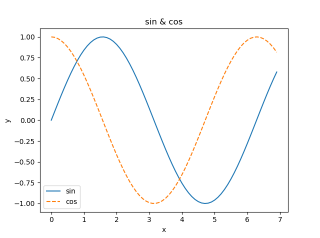
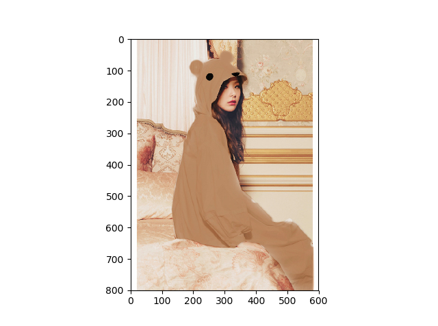

# 목차
[1. 머신러닝의 유형](#머신러닝의-유형)  

[2. 설치](#설치)  
[2-1. 파이썬](#파이썬)  
[2-2. 아나콘다](#아나콘다)  

[3. 파이썬 기본 문법](#파이썬-기본-문법)  
[3-1. 연산자](#연산자)  
[3-2. 자료형](#자료형)  
[3-3. 리스트](#리스트)  
[3-4. 딕셔너리](#딕셔너리)  
[3-5. bool](#bool)  
[3-6. 함수](#함수)  
[3-7. for](#for)  

[4. 파이썬 스크립트 파일](#파이선-스크립트-파일)  
[4-1. 파일 만들기](#파일-만들기)  
[4-2. 클래스](#클래스)  

[5. 넘파이](#넘파이)  
[5-1. 넘파이의 N차원 배열](#넘파이의-N차원-배열)  
[5-2. 브로드캐스트](#브로드캐스트)  

[6. matplotlib](#matplotlib)  
[6-1. pyplot](#pyplot)  
[6-2. pyplot으로 이미지 출력](#pyplot으로-이미지-출력)  

[7. 퍼셉트론이란?](#퍼셉트론이란?)  

[8. 기초 논리 회로](#기초-논리-회로)  
[8-1. AND 게이트](#AND-게이트)  
[8-2. NAND 게이트](#NAND-게이트)  
[8-3. OR 게이트](#OR-게이트)  

[9. 퍼셉트론 구현](#퍼셉트론-구현)  
[9-1. AND 게이트의 구현](#AND-게이트의-구현)  
[9-2. NAND 게이트의 구현](#NAND-게이트의-구현)  
[9-3. OR 게이트의 구현](#OR-게이트의-구현)  

[10. XOR 게이트](#XOR-게이트)  
[10-1. XOR 게이트의 정의](#XOR-게이트의-정의)  
[10-2. XOR 게이트의 구현](#XOR-게이트의-구현)  


# 머신러닝의 유형
## 1. 지도 학습 (Supervised Learning)
 : 훈련 데이터로 모델을 학습하여 경험하지 못한 데이터나 미래의 데이터에 관한 예측을 만드는 것.
## 2. 비지도 학습 (Unsupervised Learning)
 : 레이블이 없거나 구조를 모르는 데이터를 다뤄 결과변수나 보상함수의 도움 없이 데이터 구조를 탐색해 의미 있는 정보를 추출하는 것.
## 3. 강화 학습 (Reinforcement Learning)
 : 환경과의 상호작용을 기반으로 자신의 성능을 개선하는 시스템 개발.
 <br><br><br>

# 설치
## 파이썬
파이썬은 3.4.3 이상을 추천. 나는 3.7.2 최신 버전(2019년 3월 13일 기준)을 받았다.

그 다음 cmd에서 
pip install SomePackage
pip install SomePackage --upgrade
를 입력해 추가 파이썬 패키지를 설치, 업그레이드한다.

## 아나콘다

그리고 Anaconda를 받는다. 
데이터과학, 수학, 공학을 위한 파이썬의 모든 필수 요소들을 갖추고 있다.
https://www.anaconda.com/distribution/#download-section

그리고 아나콘다가 Code랑 파트너십을 맺고 있다길래 Visual Studio Code도 깔았다.

cmd에서 
conda install SomePackage
conda update SomePackage
를 해준다.


cmd에서
python --version
을 치면 python 3.7.1이라고 뜬다.
 <br><br><br>

# 파이썬 기본 문법

## 연산자
+-*/ 는 그대로  
**는 거듭제곱 (3 ** 2 = 9)


## 자료형
int, float 등. str은 문자열


type(1) => int라고 출력  
type("xx") => str라고 출력  


print() <= 출력함수

x = 1  
print(x) <= 1이라고 출력


## 리스트
a = [1, 2, 3]  
print(a) <= [1, 2, 3] 출력  
len(a) <= 3 출력  
a[0] <= 1 출력  
a[0:2] <= [1, 2] 출력  
a[1:3] <= [2, 3] 출력  
a[:2] <= [1, 2] 출력  
a[2:] <= [3] 출력  
a[:-2] <= [1] 출력  
a[:-1] <= [1, 2] 출력


## 딕셔너리
a = {'q':1}  
a <= {'q':1} 출력  
a['q'] <= 1 출력  
a['w'] = 2  
print(a) <= {'q': 1, 'w': 2} 출력  


## bool
i = True  
you = False  
type(i) <= bool 출력  
i <= true 출력  
you = false 출력  
not i <= false 출력  
i and you <= false 출력  
i or you <= true 출력  


## 함수
def what(o):  
	print("the "+o)  
what("hell") <= the hell 출력


## for
for i in[3,2,1]:  
	print(i)  
<=3 2 1이 세 줄로 나뉘어 출력


 <br><br><br>

 # 파이썬 스크립트 파일

## 파일 만들기
 파이썬 스크립트 파일의 확장자는 *.py  
 
 1.py에  

```python
 print("Hello World!")  
```

 를 적고 cmd에서 python 1.py를 해주면  

 Hello World!  

 가 출력된다  

 ## 클래스

 ```python
class Name:
    def __init__(self, name = "Tom"):
        self.name = name
        print("My Name Is " + self.name)

    def hello(self):
        print("Hello" + self.name)
    
    def bye(self):
        print("bye" + self.name)

a = Name()
b = Name("Jack")
a.hello()
b.hello()
a.bye()
b.bye()
```

self는 자신의 인스턴스를 나타냄.  
__init__은 생성자 함수  

여기서 Name은 클래스, __init__은 생성자 메소드이며 hello와 bye는 클래스의 메소드이다.  
그리고 self.name은 인스턴스 변수이다.  

<br><br><br>

# 넘파이

파이썬은 라이브러리를 import 문으로 가져온다.  
```python
import numpy as np

x = np.array([1.0, 2.0, 3.0])
y = np.array([2.0, 4.0, 6.0])
print(x) #[1. 2. 3.]
print(y) #[2. 4. 6.]
print(type(x)) #<class 'numpy.ndarray'>
print(x+y) #[3. 6. 9.]
print(x-y) #[-1. -2. -3.]
print(x*y) #[ 2.  8. 18.]
print(x/y) #[0.5 0.5 0.5]
```
배열의 산술 연산이다.  
배열 x와 y의 원소 수가 같다는 데에 주의하자. 같은 경우에만 산술 연산이 가능하다.  
원소 수가 다르면 에러가 난다.   

## 넘파이의 N차원 배열
```python
import numpy as np

a = np.array([[1, 2], [3, 4]])
print(a)    # [[1 2]
            #  [3 4]]
print(a.shape) #(2. 2)
print(a.dtype) #int32
b = np.array([[3,0],[0,6]])
print(a+b)  #[[ 4  2]
            # [ 3 10]]
print(a*b)  #[[ 3  0]
            # [ 0 24]]
```
shape는 n차원 배열에서 각 차원의 원소 수를 나타낸다.  
dtype은 행렬에 속한 원소의 자료형이다.  

## 브로드캐스트

배열과 스칼라값의 조합으로 된 산술 연산도 가능한데, 스칼라값과의 계산이 배열의 원소 별로 한 번씩 수행되며 이를 '브로드캐스트'라고 부른다.  

```python
import numpy as np

a = np.array([[1,2],[3,4]])
b = np.array([10,20])
print(a*b)  #[[10 40]
            # [30 80]]
c = 3
print(b*c) #[30 60]
print(a[1]) #[3 4]
print(a[0][1]) #2
for row in a:
    print(row)  #[1 2]
                #[3 4]

x = a.flatten() #a를 1차원 배열화
print(x) #[1 2 3 4]
print(x[np.array([0,2])])   #[1 3]
print(x > 2) #[False False True True]
print(x[x>2]) #[3 4]
```
flatten은 1차원 배열로 평탄화하는 메소드이다.  

<br><br><br>

# matplotlib
그래프를 그려주는 데이터 시각화 라이브러리.  

## pyplot
pyplot 모듈은 그래프를 그리는 기능을 담당한다.  

```python
import numpy as np
import matplotlib.pyplot as plt

x = np.arange(0, 7, 0.1) #0부터 7까지 0.1 간격으로 생성
y = np.sin(x)
z = np.cos(x)

plt.plot(x,y, label = "sin")
plt.plot(x,z, linestyle = "--", label = "cos") #linestyle은 줄의 종류, label은 해당 줄의 명칭 
plt.xlabel("x")
plt.ylabel("y")
plt.title("sin & cos")
plt.legend() #축에 범례를 넣어줌 (위의 plot의 라벨과 라인스타일에 대한 정의를 표시해준다)
plt.show() #그래프 출력
```



## pyplot으로 이미지 출력
```python
import matplotlib.pyplot as plt
from matplotlib.image import imread

img = imread('seulgi.jpg') #상대경로 이용
plt.imshow(img) #이미지를 표시해주는 메소드
plt.show() #이미지 출력
```


<br><br><br>

# 퍼셉트론이란?
1957년에 프랑크 로젠블라트가 고안한, 딥러닝의 기원이 되는 알고리즘.  

여기서 설명할 것은 인공 뉴런이라고도 불리는 단순 퍼셉트론이다.  

퍼셉트론은 다수의 신호를 입력으로 받아 '흐른다(1) / 흐르지 않는다(0)'라는 하나의 신호를 출력한다.  

퍼셉트론이 여러 신호(x)를 입력받을 때, 각 신호마다 가중치(w)를 두고 신호에 가중치를 곱해(wx) 입력된다. 그리고 뉴런에서 보내온 신호의 총합(wx들의 합)이 정해둔 한계(임계값 θ)를 넘어서면 1을 출력한다.(=뉴런이 활성화된다)  

즉, 퍼셉트론의 동작 원리는  

y = (w1*x1 + w2*x2 + ... <= θ) ? 0 : 1  

이라고 볼 수 있다.  

<br><br><br>

# 기초 논리 회로

## AND 게이트

입력은 둘, 출력은 하나.  

AND 게이트의 진리표  
x1 | x2 | y
---- | ---- | ----
0 | 0 | 0
1 | 0 | 0
0 | 1 | 0
1 | 1 | 1

퍼셉트론으로 표시할 경우 x1*w1 + x2*w2 > θ면 AND 게이트의 조건이 만족됨을 기억해라.

## NAND 게이트

NAND = Not AND  

NAND 게이트의 진리표  
x1 | x2 | y
---- | ---- | ----
0 | 0 | 1
1 | 0 | 1
0 | 1 | 1
1 | 1 | 0

## OR 게이트

OR 게이트의 진리표  
x1 | x2 | y
---- | ---- | ----
0 | 0 | 0
1 | 0 | 1
0 | 1 | 1
1 | 1 | 1

<br><br><br>

# 퍼셉트론 구현

## AND 게이트의 구현
```python
import numpy as np
def AND(x = np.array([0,0]), w = np.array([1.0, 1.0]), theta = 1.0, b = 0):
    temp = x*w
    input = temp[0]+temp[1]+b
    if input <= theta:
        return 0
    elif input > theta:
        return 1

input = np.array([[0, 0],[1,0],[0,1],[1,1]])
weight = np.array([0.5, 0.5])
theta = 0.8
bias = -0.1
for i in range(0,4):
    print(AND(input[i],weight,theta,bias)) 
    #0,0일 때 0 / 0*0.5+0*0.5-0.1 = -0.1 <= 0.8
    #1,0일 때 0 / 1*0.5+0*0.5-0.1 = 0.4 <= 0.8
    #0,1일 때 0 / 0*0.5+1*0.5-0.1 = 0.4 <= 0.8
    #1,1일 때 1 / 1*0.5+1*0.5-0.1 = 0.9 > 0.8
```
AND 게이트를 구현한 코드이다.  
여기서 x는 입력 신호, w는 가중치, theta는 임계값, b는 편향을 나타낸다.  
퍼셉트론은 입력 신호에 가중치를 곱한 값과 편향을 합했을 때, 그 값이 임계값을 넘으면 1을 출력하고 아닌 경우엔 0을 출력한다.  

가중치는 입력 신호가 결과에 주는 중요도를 조절하는 매개변수.  
편향은 뉴런이 얼마나 쉽게 활성화되느냐를 조절하는 매개변수.  

## NAND 게이트의 구현

```python
import numpy as np
def NAND(x = np.array([0,0]), w = np.array([-1.0, -1.0]), theta = -1.0, b = 0):
    temp = x*w+b
    input = temp[0]+temp[1]
    if input <= theta:
        return 0
    elif input > theta:
        return 1

input = np.array([[0, 0],[1,0],[0,1],[1,1]])
weight = np.array([-0.5, -0.5])
theta = -0.8
bias = 0.1
for i in range(0,4):
    print(NAND(input[i],weight,theta,bias)) 
    #0,0일 때 1 / 0*(-0.5)+0*(-0.5)+0.1 = 0.1 > -0.8
    #1,0일 때 1 / 1*(-0.5)+0*(-0.5)+0.1 = -0.4 > -0.8
    #0,1일 때 1 / 0*(-0.5)+1*(-0.5)+0.1 = -0.4 > -0.8
    #1,1일 때 0 / 1*(-0.5)+1*(-0.5)+0.1 = -0.9 <= -0.8
```
AND게이트에서 가중치, 세타, 편향값만 (* -1) 해주었다.

## OR 게이트의 구현

```python
import numpy as np
def OR(x = np.array([0,0]), w = np.array([1.0, 1.0]), theta = 1.0, b = 0):
    temp = x*w
    input = temp[0]+temp[1]+b
    if input <= theta:
        return 0
    elif input > theta:
        return 1

input = np.array([[0, 0],[1,0],[0,1],[1,1]])
weight = np.array([0.5, 0.5])
theta = 0.8
bias = 0.4
for i in range(0,4):
    print(OR(input[i],weight,theta,bias))
    # 0,0일 때 0 / 0*0.5+0*0.5+0.4 = 0.4 <= 0.8
    # 1,0일 때 1 / 1*0.5+0*0.5+0.4 = 0.9 > 0.8
    # 0,1일 때 1 / 0*0.5+1*0.5+0.4 = 0.9 > 0.8
    # 1,1일 때 1 / 1*0.5+1*0.5+0.4 = 1.4 > 0.8
```

AND와 NAND, OR은 기본 구조는 같은데 가중치와 편향값만 나뉜다.

<br><br><br>

# XOR 게이트

## XOR 게이트의 정의

XOR 게이트는 '배타적 논리합'이라는 논리 회로이다.  

XOR 게이트의 진리표
x1 | x2 | y
---- | ---- | ----
0 | 0 | 0
1 | 0 | 1
0 | 1 | 1
1 | 1 | 0

XOR 게이트는 두 개의 입력 신호 중 하나만 1일 때 1을 출력한다.  

XOR은 지금 위에서 본 퍼셉트론으로는 구현이 불가능하다. 왜냐면 다른 경우에만 출력되는 경우를 직선 하나로 그래프화할 수 없기 때문.  
위에서 본 OR, AND, NAND 게이트는 선형 영역으로만 표시할 수 있는 게이트들이었다면, XOR 게이트는 그래프 상에서 곡선으로 표시되는 비선형 영역이 필요한 게이트이다.  

XOR 게이트를 퍼셉트론으로 표현하기 위해서는, '다층 퍼셉트론'을 이용해야 한다.  
퍼셉트론은 층을 쌓아 다층 퍼셉트론(multi-layer perceptron)으로 만들 수 있다.  

## XOR 게이트의 구현
두 입력 신호에 대해 NAND 게이트를 거친 출력 신호와 OR 게이트를 거친 출력 신호를 입력 신호로 한 AND 게이트의 출력 신호가 XOR 값과 일치한다.

```python
import numpy as np
def AND(x = np.array([0,0]), w = np.array([1.0, 1.0]), theta = 1.0, b = 0):
    temp = x*w
    input = temp[0]+temp[1]+b
    if input <= theta:
        return 0
    elif input > theta:
        return 1

def NAND(x = np.array([0,0]), w = np.array([-1.0, -1.0]), theta = -1.0, b = 0):
    temp = x*(-1*w)+(-1*b)
    input = temp[0]+temp[1]
    if input <= (-1*theta):
        return 0
    elif input > (-1*theta):
        return 1

def OR(x = np.array([0,0]), w = np.array([1.0, 1.0]), theta = 1.0, b = 0):
    temp = x*w
    input = temp[0]+temp[1]+b
    if input <= theta:
        return 0
    elif input > theta:
        return 1

def XOR(x = np.array([0,0]), w = np.array([1.0, 1.0]), thetaNand = 1.0, thetaOr = 1.0, b = 0):
    nx = NAND(x,w,thetaNand,b)
    ox = OR(x,w,thetaOr,b)
    y = np.array([nx,ox])
    return AND(y,w,thetaNand,b)


input = np.array([[0, 0],[1,0],[0,1],[1,1]])
weight = np.array([0.5, 0.5])
thetaNand = 0.9
thetaOr = 0.4
bias = 0
for i in range(0,4):
    print("XOR : {0}".format(XOR(input[i],weight,thetaNand, thetaOr,bias))) # 0 1 1 0
```

여기서 기본 입력 신호인 x1, x2가 0층  
NAND와 OR의 출력 신호이자 AND의 입력 신호인 nx, ox가 1층  
XOR을 거친 최종 출력신호가 2층이라고 볼 수 있다.  
이렇게 위 XOR의 퍼셉트론은 총 3층이지만, 가중치를 갖는 층은 0층과 1층 사이, 1층과 2층 사이의 두 층이면 '2층 퍼셉트론'이라 부른다. 허나 문헌에 따라 '3층 퍼셉트론'이라고 부르기도 하니 주의하자.  

이렇게 단층 퍼셉트론으로는 표현하지 못하는 것을 층을 늘려 구현할 수 있다.  

NAND 게이트의 조합만으로도 테트리스를 할 수 있는 컴퓨터를 만들기도 한다. 퍼셉트론을 층으로 거듭 쌓으면 비선형적인 표현도 가능하고 컴퓨터도 만들 수 있다는 것을 인식만 해두자.