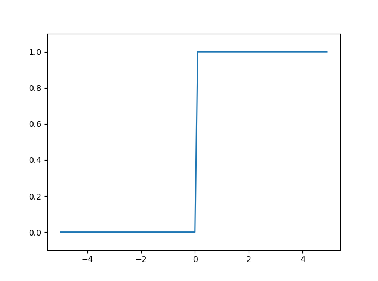
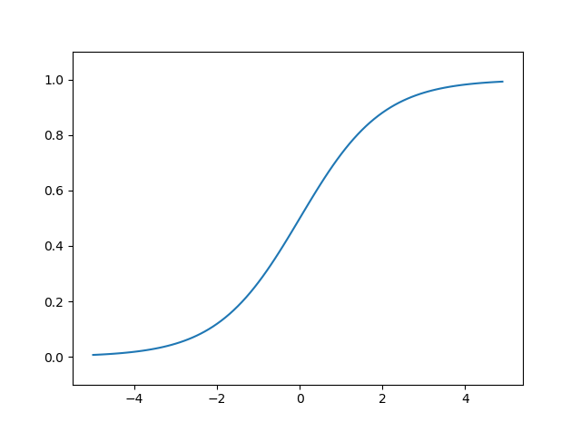
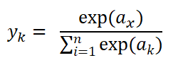

책을 보며 공부한 내용을 필기한 것.  


# 목차
[1. 머신러닝의 유형](#머신러닝의-유형)  

[2. 설치](#설치)  
[2-1. 파이썬](#파이썬)  
[2-2. 아나콘다](#아나콘다)  

[3. 파이썬 기본 문법](#파이썬-기본-문법)  
[3-1. 연산자](#연산자)  
[3-2. 자료형](#자료형)  
[3-3. 리스트](#리스트)  
[3-4. 딕셔너리](#딕셔너리)  
[3-5. bool](#bool)  
[3-6. 함수](#함수)  
[3-7. for](#for)  

[4. 파이썬 스크립트 파일](#파이선-스크립트-파일)  
[4-1. 파일 만들기](#파일-만들기)  
[4-2. 클래스](#클래스)  

[5. 넘파이](#넘파이)  
[5-1. 넘파이의 N차원 배열](#넘파이의-N차원-배열)  
[5-2. 브로드캐스트](#브로드캐스트)  

[6. matplotlib](#matplotlib)  
[6-1. pyplot](#pyplot)  
[6-2. pyplot으로 이미지 출력](#pyplot으로-이미지-출력)  

[7. 퍼셉트론이란?](#퍼셉트론이란?)  

[8. 기초 논리 회로](#기초-논리-회로)  
[8-1. AND 게이트](#AND-게이트)  
[8-2. NAND 게이트](#NAND-게이트)  
[8-3. OR 게이트](#OR-게이트)  

[9. 퍼셉트론 구현](#퍼셉트론-구현)  
[9-1. AND 게이트의 구현](#AND-게이트의-구현)  
[9-2. NAND 게이트의 구현](#NAND-게이트의-구현)  
[9-3. OR 게이트의 구현](#OR-게이트의-구현)  

[10. XOR 게이트](#XOR-게이트)  
[10-1. XOR 게이트의 정의](#XOR-게이트의-정의)  
[10-2. XOR 게이트의 구현](#XOR-게이트의-구현)  

[11. 신경망](#신경망)  

[12. 활성화 함수](#활성화-함수)  
[12-1. 계단 함수](#계단-함수)  
[12-2. 시그모이드 함수](#시그모이드-함수)  
[12-3. 계단 함수와 시그모이드 함수의 비교](#계단-함수와-시그모이드-함수의-비교)  
[12-4. 비선형 함수](#비선형-함수)  
[12-5. ReLU 함수](#ReLU-함수)  

[13. 다차원 배열의 계산](#다차원-배열의-계산)  
[13-1. 다차원 배열](#다차원-배열)  
[13-2. 행렬의 내적](#행렬의-내적)  
[13-3. 신경망의 내적](#신경망의-내적)  

[14. 3층 신경망 구현하기](#3층-신경망-구현하기)  

[15. 출력층 설계하기](#출력층-설계하기)  
[15-1. 항등 함수와 소프트맥스 함수](#항등-함수와-소프트맥스-함수)  
[15-2. 소프트맥스 함수의 특징](#소프트맥스-함수의-특징)  
[15-3. 출력층의 뉴런 수 정하기](#출력층의-뉴런-수-정하기)  


# 머신러닝의 유형
## 1. 지도 학습 (Supervised Learning)
 : 훈련 데이터로 모델을 학습하여 경험하지 못한 데이터나 미래의 데이터에 관한 예측을 만드는 것.
## 2. 비지도 학습 (Unsupervised Learning)
 : 레이블이 없거나 구조를 모르는 데이터를 다뤄 결과변수나 보상함수의 도움 없이 데이터 구조를 탐색해 의미 있는 정보를 추출하는 것.
## 3. 강화 학습 (Reinforcement Learning)
 : 환경과의 상호작용을 기반으로 자신의 성능을 개선하는 시스템 개발.
 <br><br><br>

# 설치
## 파이썬
파이썬은 3.4.3 이상을 추천. 나는 3.7.2 최신 버전(2019년 3월 13일 기준)을 받았다.

그 다음 cmd에서 
pip install SomePackage
pip install SomePackage --upgrade
를 입력해 추가 파이썬 패키지를 설치, 업그레이드한다.

## 아나콘다

그리고 Anaconda를 받는다. 
데이터과학, 수학, 공학을 위한 파이썬의 모든 필수 요소들을 갖추고 있다.
https://www.anaconda.com/distribution/#download-section

그리고 아나콘다가 Code랑 파트너십을 맺고 있다길래 Visual Studio Code도 깔았다.

cmd에서 
conda install SomePackage
conda update SomePackage
를 해준다.


cmd에서
python --version
을 치면 python 3.7.1이라고 뜬다.
 <br><br><br>

# 파이썬 기본 문법

## 연산자
+-*/ 는 그대로  
**는 거듭제곱 (3 ** 2 = 9)


## 자료형
int, float 등. str은 문자열


type(1) => int라고 출력  
type("xx") => str라고 출력  


print() <= 출력함수

x = 1  
print(x) <= 1이라고 출력


## 리스트
a = [1, 2, 3]  
print(a) <= [1, 2, 3] 출력  
len(a) <= 3 출력  
a[0] <= 1 출력  
a[0:2] <= [1, 2] 출력  
a[1:3] <= [2, 3] 출력  
a[:2] <= [1, 2] 출력  
a[2:] <= [3] 출력  
a[:-2] <= [1] 출력  
a[:-1] <= [1, 2] 출력


## 딕셔너리
a = {'q':1}  
a <= {'q':1} 출력  
a['q'] <= 1 출력  
a['w'] = 2  
print(a) <= {'q': 1, 'w': 2} 출력  


## bool
i = True  
you = False  
type(i) <= bool 출력  
i <= true 출력  
you = false 출력  
not i <= false 출력  
i and you <= false 출력  
i or you <= true 출력  


## 함수
def what(o):  
	print("the "+o)  
what("hell") <= the hell 출력


## for
for i in[3,2,1]:  
	print(i)  
<=3 2 1이 세 줄로 나뉘어 출력


 <br><br><br>

 # 파이썬 스크립트 파일

## 파일 만들기
 파이썬 스크립트 파일의 확장자는 *.py  
 
 1.py에  

```python
 print("Hello World!")  
```

 를 적고 cmd에서 python 1.py를 해주면  

 Hello World!  

 가 출력된다  

 ## 클래스

 ```python
class Name:
    def __init__(self, name = "Tom"):
        self.name = name
        print("My Name Is " + self.name)

    def hello(self):
        print("Hello" + self.name)
    
    def bye(self):
        print("bye" + self.name)

a = Name()
b = Name("Jack")
a.hello()
b.hello()
a.bye()
b.bye()
```

self는 자신의 인스턴스를 나타냄.  
__init__은 생성자 함수  

여기서 Name은 클래스, __init__은 생성자 메소드이며 hello와 bye는 클래스의 메소드이다.  
그리고 self.name은 인스턴스 변수이다.  

<br><br><br>

# 넘파이

파이썬은 라이브러리를 import 문으로 가져온다.  
```python
import numpy as np

x = np.array([1.0, 2.0, 3.0])
y = np.array([2.0, 4.0, 6.0])
print(x) #[1. 2. 3.]
print(y) #[2. 4. 6.]
print(type(x)) #<class 'numpy.ndarray'>
print(x+y) #[3. 6. 9.]
print(x-y) #[-1. -2. -3.]
print(x*y) #[ 2.  8. 18.]
print(x/y) #[0.5 0.5 0.5]
```
배열의 산술 연산이다.  
배열 x와 y의 원소 수가 같다는 데에 주의하자. 같은 경우에만 산술 연산이 가능하다.  
원소 수가 다르면 에러가 난다.   

## 넘파이의 N차원 배열
```python
import numpy as np

a = np.array([[1, 2], [3, 4]])
print(a)    # [[1 2]
            #  [3 4]]
print(a.shape) #(2. 2)
print(a.dtype) #int32
b = np.array([[3,0],[0,6]])
print(a+b)  #[[ 4  2]
            # [ 3 10]]
print(a*b)  #[[ 3  0]
            # [ 0 24]]
```
shape는 n차원 배열에서 각 차원의 원소 수를 나타낸다.  
dtype은 행렬에 속한 원소의 자료형이다.  

## 브로드캐스트

배열과 스칼라값의 조합으로 된 산술 연산도 가능한데, 스칼라값과의 계산이 배열의 원소 별로 한 번씩 수행되며 이를 '브로드캐스트'라고 부른다.  

```python
import numpy as np

a = np.array([[1,2],[3,4]])
b = np.array([10,20])
print(a*b)  #[[10 40]
            # [30 80]]
c = 3
print(b*c) #[30 60]
print(a[1]) #[3 4]
print(a[0][1]) #2
for row in a:
    print(row)  #[1 2]
                #[3 4]

x = a.flatten() #a를 1차원 배열화
print(x) #[1 2 3 4]
print(x[np.array([0,2])])   #[1 3]
print(x > 2) #[False False True True]
print(x[x>2]) #[3 4]
```
flatten은 1차원 배열로 평탄화하는 메소드이다.  

<br><br><br>

# matplotlib
그래프를 그려주는 데이터 시각화 라이브러리.  

## pyplot
pyplot 모듈은 그래프를 그리는 기능을 담당한다.  

```python
import numpy as np
import matplotlib.pyplot as plt

x = np.arange(0, 7, 0.1) #0부터 7까지 0.1 간격으로 생성
y = np.sin(x)
z = np.cos(x)

plt.plot(x,y, label = "sin")
plt.plot(x,z, linestyle = "--", label = "cos") #linestyle은 줄의 종류, label은 해당 줄의 명칭 
plt.xlabel("x")
plt.ylabel("y")
plt.title("sin & cos")
plt.legend() #축에 범례를 넣어줌 (위의 plot의 라벨과 라인스타일에 대한 정의를 표시해준다)
plt.show() #그래프 출력
```


## pyplot으로 이미지 출력
```python
import matplotlib.pyplot as plt
from matplotlib.image import imread

img = imread('seulgi.jpg') #상대경로 이용
plt.imshow(img) #이미지를 표시해주는 메소드
plt.show() #이미지 출력
```


<br><br><br>

# 퍼셉트론이란?
1957년에 프랑크 로젠블라트가 고안한, 딥러닝의 기원이 되는 알고리즘.  

여기서 설명할 것은 인공 뉴런이라고도 불리는 단순 퍼셉트론이다.  

퍼셉트론은 다수의 신호를 입력으로 받아 '흐른다(1) / 흐르지 않는다(0)'라는 하나의 신호를 출력한다.  

퍼셉트론이 여러 신호(x)를 입력받을 때, 각 신호마다 가중치(w)를 두고 신호에 가중치를 곱해(wx) 입력된다. 그리고 뉴런에서 보내온 신호의 총합(wx들의 합)이 정해둔 한계(임계값 θ)를 넘어서면 1을 출력한다.(=뉴런이 활성화된다)  

즉, 퍼셉트론의 동작 원리는  

y = (w1*x1 + w2*x2 + ... <= θ) ? 0 : 1  

이라고 볼 수 있다.  

<br><br><br>

# 기초 논리 회로

## AND 게이트

입력은 둘, 출력은 하나.  

AND 게이트의 진리표  

x1 | x2 | y
-------- | -------- | --------
0 | 0 | 0
1 | 0 | 0
0 | 1 | 0
1 | 1 | 1

퍼셉트론으로 표시할 경우 x1*w1 + x2*w2 > θ면 AND 게이트의 조건이 만족됨을 기억해라.

## NAND 게이트

NAND = Not AND  

NAND 게이트의 진리표  

x1 | x2 | y
-------- | -------- | --------
0 | 0 | 1
1 | 0 | 1
0 | 1 | 1
1 | 1 | 0

## OR 게이트

OR 게이트의 진리표  

x1 | x2 | y
-------- | -------- | --------
0 | 0 | 0
1 | 0 | 1
0 | 1 | 1
1 | 1 | 1

<br><br><br>

# 퍼셉트론 구현

## AND 게이트의 구현
```python
import numpy as np
def AND(x = np.array([0,0]), w = np.array([1.0, 1.0]), theta = 1.0, b = 0):
    temp = x*w
    input = temp[0]+temp[1]+b
    if input <= theta:
        return 0
    elif input > theta:
        return 1

input = np.array([[0, 0],[1,0],[0,1],[1,1]])
weight = np.array([0.5, 0.5])
theta = 0.8
bias = -0.1
for i in range(0,4):
    print(AND(input[i],weight,theta,bias)) 
    #0,0일 때 0 / 0*0.5+0*0.5-0.1 = -0.1 <= 0.8
    #1,0일 때 0 / 1*0.5+0*0.5-0.1 = 0.4 <= 0.8
    #0,1일 때 0 / 0*0.5+1*0.5-0.1 = 0.4 <= 0.8
    #1,1일 때 1 / 1*0.5+1*0.5-0.1 = 0.9 > 0.8
```
AND 게이트를 구현한 코드이다.  
여기서 x는 입력 신호, w는 가중치, theta는 임계값, b는 편향을 나타낸다.  
퍼셉트론은 입력 신호에 가중치를 곱한 값과 편향을 합했을 때, 그 값이 임계값을 넘으면 1을 출력하고 아닌 경우엔 0을 출력한다.  

가중치는 입력 신호가 결과에 주는 중요도를 조절하는 매개변수.  
편향은 뉴런이 얼마나 쉽게 활성화되느냐를 조절하는 매개변수.  

## NAND 게이트의 구현

```python
import numpy as np
def NAND(x = np.array([0,0]), w = np.array([-1.0, -1.0]), theta = -1.0, b = 0):
    temp = x*w+b
    input = temp[0]+temp[1]
    if input <= theta:
        return 0
    elif input > theta:
        return 1

input = np.array([[0, 0],[1,0],[0,1],[1,1]])
weight = np.array([-0.5, -0.5])
theta = -0.8
bias = 0.1
for i in range(0,4):
    print(NAND(input[i],weight,theta,bias)) 
    #0,0일 때 1 / 0*(-0.5)+0*(-0.5)+0.1 = 0.1 > -0.8
    #1,0일 때 1 / 1*(-0.5)+0*(-0.5)+0.1 = -0.4 > -0.8
    #0,1일 때 1 / 0*(-0.5)+1*(-0.5)+0.1 = -0.4 > -0.8
    #1,1일 때 0 / 1*(-0.5)+1*(-0.5)+0.1 = -0.9 <= -0.8
```
AND게이트에서 가중치, 세타, 편향값만 (* -1) 해주었다.

## OR 게이트의 구현

```python
import numpy as np
def OR(x = np.array([0,0]), w = np.array([1.0, 1.0]), theta = 1.0, b = 0):
    temp = x*w
    input = temp[0]+temp[1]+b
    if input <= theta:
        return 0
    elif input > theta:
        return 1

input = np.array([[0, 0],[1,0],[0,1],[1,1]])
weight = np.array([0.5, 0.5])
theta = 0.8
bias = 0.4
for i in range(0,4):
    print(OR(input[i],weight,theta,bias))
    # 0,0일 때 0 / 0*0.5+0*0.5+0.4 = 0.4 <= 0.8
    # 1,0일 때 1 / 1*0.5+0*0.5+0.4 = 0.9 > 0.8
    # 0,1일 때 1 / 0*0.5+1*0.5+0.4 = 0.9 > 0.8
    # 1,1일 때 1 / 1*0.5+1*0.5+0.4 = 1.4 > 0.8
```

AND와 NAND, OR은 기본 구조는 같은데 가중치와 편향값만 나뉜다.

<br><br><br>

# XOR 게이트

## XOR 게이트의 정의

XOR 게이트는 '배타적 논리합'이라는 논리 회로이다.  

XOR 게이트의 진리표  

x1 | x2 | y
-------- | -------- | --------
0 | 0 | 0
1 | 0 | 1
0 | 1 | 1
1 | 1 | 0

XOR 게이트는 두 개의 입력 신호 중 하나만 1일 때 1을 출력한다.  

XOR은 지금 위에서 본 퍼셉트론으로는 구현이 불가능하다. 왜냐면 다른 경우에만 출력되는 경우를 직선 하나로 그래프화할 수 없기 때문.  
위에서 본 OR, AND, NAND 게이트는 선형 영역으로만 표시할 수 있는 게이트들이었다면, XOR 게이트는 그래프 상에서 곡선으로 표시되는 비선형 영역이 필요한 게이트이다.  

XOR 게이트를 퍼셉트론으로 표현하기 위해서는, '다층 퍼셉트론'을 이용해야 한다.  
퍼셉트론은 층을 쌓아 다층 퍼셉트론(multi-layer perceptron)으로 만들 수 있다.  

## XOR 게이트의 구현
두 입력 신호에 대해 NAND 게이트를 거친 출력 신호와 OR 게이트를 거친 출력 신호를 입력 신호로 한 AND 게이트의 출력 신호가 XOR 값과 일치한다.

```python
import numpy as np
def AND(x = np.array([0,0]), w = np.array([1.0, 1.0]), theta = 1.0, b = 0):
    temp = x*w
    input = temp[0]+temp[1]+b
    if input <= theta:
        return 0
    elif input > theta:
        return 1

def NAND(x = np.array([0,0]), w = np.array([-1.0, -1.0]), theta = -1.0, b = 0):
    temp = x*(-1*w)+(-1*b)
    input = temp[0]+temp[1]
    if input <= (-1*theta):
        return 0
    elif input > (-1*theta):
        return 1

def OR(x = np.array([0,0]), w = np.array([1.0, 1.0]), theta = 1.0, b = 0):
    temp = x*w
    input = temp[0]+temp[1]+b
    if input <= theta:
        return 0
    elif input > theta:
        return 1

def XOR(x = np.array([0,0]), w = np.array([1.0, 1.0]), thetaNand = 1.0, thetaOr = 1.0, b = 0):
    nx = NAND(x,w,thetaNand,b)
    ox = OR(x,w,thetaOr,b)
    y = np.array([nx,ox])
    return AND(y,w,thetaNand,b)


input = np.array([[0, 0],[1,0],[0,1],[1,1]])
weight = np.array([0.5, 0.5])
thetaNand = 0.9
thetaOr = 0.4
bias = 0
for i in range(0,4):
    print("XOR : {0}".format(XOR(input[i],weight,thetaNand, thetaOr,bias))) # 0 1 1 0
```

여기서 기본 입력 신호인 x1, x2가 0층  
NAND와 OR의 출력 신호이자 AND의 입력 신호인 nx, ox가 1층  
XOR을 거친 최종 출력신호가 2층이라고 볼 수 있다.  
이렇게 위 XOR의 퍼셉트론은 총 3층이지만, 가중치를 갖는 층은 0층과 1층 사이, 1층과 2층 사이의 두 층이면 '2층 퍼셉트론'이라 부른다. 허나 문헌에 따라 '3층 퍼셉트론'이라고 부르기도 하니 주의하자.  

이렇게 단층 퍼셉트론으로는 표현하지 못하는 것을 층을 늘려 구현할 수 있다.  

NAND 게이트의 조합만으로도 테트리스를 할 수 있는 컴퓨터를 만들기도 한다. 퍼셉트론을 층으로 거듭 쌓으면 비선형적인 표현도 가능하고 컴퓨터도 만들 수 있다는 것을 인식만 해두자.  

<br><br><br>

# 신경망
퍼셉트론은 간단하면서도 층을 쌓아 복잡한 것을 표현할 수 있는 장점이 있지만,  
가중치를 사람이 수동으로 설정해야 한다는 것이 가장 큰 단점이다.  
이를 해결할 수 있는 것이 신경망이다.  
신경망은 가중치 매개변수의 적절한 값을 데이터로부터 자동으로 학습하는 성질을 가졌다.  

신경망은 입력층과 출력층, 그리고 그 사이에 은닉층이 존재한다.  
여기서 은닉층은 입출력층과 달리 시각화되지 않기 떄문에 '은닉'이라 표현한다.  

<br><br><br>

# 활성화 함수

입력신호의 총합을 출력 신호로 변환하는 함수로, 입력 신호의 총합이 활성화를 일으키는지 정하는 역할을 한다.  

a = b + (w1*x1) + (w2*x2)  
y = h(a)  

이렇게 편향과 입력 신호, 가중치의 합을 a로 잡고, a를 활성화 함수 h에 넣어 출력 신호 y를 출력한다.  

활성화 함수는 임계값을 경계로 출력이 바뀌는 계단 함수와, 신경망에서 자주 이용하는 시그모이드 함수 등이 있는데,  
퍼셉트론은 계단 함수를 이용하며 이를 다른 함수로 변경한 것이 신경망이라고 볼 수 있다.  

## 계단 함수

```python
import numpy as np
def StepFunction(x):
    y = x>0
    return y.astype(np.int) 
    #astype은 데이터 타입을 바꿔주는 함수. 
    #numpy 배열에 부등호를 쓰면 bool이 리턴되는데, 우리가 필요한 건 int이므로
    #numpy.int형으로 변경해 리턴시킨다.

    #계단 함수를 이렇게 짜면 일반적인 실수들은 가능하지만 numpy 배열은 불가
#def step_function(x):    
    #if x > 0:
    #    return 1
    #else:
    #    return 0
```

이렇게 1, 0으로 리턴해주는 게 계단 함수라고 볼 수 있다.  

그래프를 그려보면  

```python
import matplotlib.pylab as plt
import numpy as np

def StepFunction(x):
    return np.array(x>0, dtype = np.int) #이렇게도 표현할 수 있다

x = np.arange(-5.0, 5.0, 0.1) #-5부터 5까지 0.1간격
y = StepFunction(x) #배열 x를 각각 계단 함수로 실행해 출력값들을 y에 넣음
plt.plot(x,y)
plt.ylim(-0.1,1.1) #y축의 범위 지정.
plt.show()
```



이런 그래프가 나온다.  

계단함수는 이렇듯 경계를 넘느냐 아니냐에 따라 1과 0으로 값이 갈리는 함수이다.  


## 시그모이드 함수

시그모이드 함수는 신경망에서 자주 이용하는 활성화 함수이다.  

시그모이드 함수 h(x) = 1 / (1 + e^(-x)) 이다.

신경망에서는 시그모이드 함수를 이용해 신호를 변환하고, 그 신호를 다음 뉴런에 전달하며 앞에서 본 단순 퍼셉트론과 신경망의 차이는 활성화 함수이다.  

```python
import numpy as np

def Sigmoid(x):
    return 1/(1+np.exp(-x))

t = np.array([-1.0,1.0,2.0])
print(Sigmoid(t)) #[0.26894142 0.73105858 0.88079709]

t = np.array([1.0,2.0,3.0])
print(1.0 + t) #[2. 3. 4.]
print(1.0 / t) #[1. 0.5 0.33333333]
```

이를 그래프로 그려보면 다음과 같다.  

```python
import matplotlib.pylab as plt
import numpy as np

def Sigmoid(x):
    return 1/(1+np.exp(-x))

x = np.arange(-5.0, 5.0, 0.1)
y = Sigmoid(x)
plt.plot(x,y)
plt.ylim(-0.1, 1.1)
plt.show()
```



계단 함수 코드와 다른 점은 함수밖에 없다.  


## 계단 함수와 시그모이드 함수의 비교

### 차이점

1. 계단 함수는 0과 1을, 시그모이드 함수는 실수값을 출력한다.
2. 계단 함수는 특정 값을 경계로 값이 바뀌지만, 시그모이드 함수는 곡선을 유지한다.

즉, 퍼셉트론은 뉴런 사이에 0과 1이, 신경망은 연속적인 실수가 흐른다.  

### 공통점
1. 입력이 작을때의 출력은 0, 입력이 높을 때의 출력은 1에 가까워진다.
2. 입력이 아무리 작거나 커도 출력은 0과 1 사이를 유지한다.
3. 비선형 함수이다.


## 비선형 함수

선형 함수는 무언가 입력했을 떄 출력이 입력의 상수배인 f(x) = ax + b 꼴의 함수이다.  
비선형 함수는 그와 달리 직선 1개로는 그릴 수 없는 함수를 뜻한다.  

신경망의 활성화 함수를 선형 함수로 한다면, 신경망의 층을 깊게 하는 의미가 없어진다.  
선형 함수는 층을 아무리 깊게 해봤자 소용이 없는게, 은닉층 없는 네트워크로도 똑같은 기능을 하게 할 수 있다.
그리하여 신경망은 활성화 함수로 비선형 함수를 사용한다.  


## ReLU 함수

ReLU 함수는 최근에 자주 쓰이는 활성화 함수이다.  
입력이 0을 넘으면 그 입력을 그대로 출력하고, 0 이하일 때는 0으로 고정한다.  

즉,  
h(x) = (x > 0) ? x : 0  
이라고 볼 수 있다.  

```python
import numpy as np

def Relu(x):
    return np.maximum(0,x)

print(Relu(-1)) #0
print(Relu(1)) #1
```

<br><br><br>

# 다차원 배열의 계산

## 다차원 배열

다차원 배열은 숫자를 N차원으로 나열하는 것을 뜻한다.  
```python
import numpy as np

x = np.array([[1,2],[3,4],[5,6]])
print(x)            #[[1 2]
                    # [3 4]
                    # [5 6]]
print(np.ndim(x))   #2
print(x.shape)      #(3, 2)
```
위 코드는 3x2 배열이다.  

여기서 2차원 배열은 행렬이라고 부르며, 배열의 가로 방향을 행, 세로 방향을 열이라고 칭한다.  


## 행렬의 내적

a1 a2  
a3 a4  
행렬 A와  

b1 b2  
b3 b4  
행렬 B를 내적하면  

a1*b1+a2*b3 a1*b2+a2*b4  
a3*b1+a3*b3 a4*b2+a4*b4  
인 행렬이 나온다.  


2x2 행렬과 2x2 행렬의 내적
```python
import numpy as np

A = np.array([[1,2],[3,4]])
B = np.array([[5,6],[7,8]])

C = np.dot(A,B) #내적을 계산해주는 numpy 함수
print(C)        #[[19 22]
                # [43 50]]
```

2x3 행렬과 3x2 행렬의 내적
```python
import numpy as np

A = np.array([[1,2,3],[4,5,6]])
B = np.array([[1,2],[3,4],[5,6]])

C = np.dot(A,B) #내적을 계산해주는 numpy 함수
print(C)        #[[22 28]
                # [49 64]]
```

2x3 행렬과 3x4 행렬을 내적하면 2x4 행렬이 나온다.  
이렇듯 AxB 행렬과 CxD 행렬을 내적하기 위해서는  
B와 C가 같은 수여야 하고, 출력은 AxD 행렬로 나온다는 것을 명심하여야 한다.  

## 신경망의 내적

편향과 활성화 함수를 생략하고 가중치만 둔 신경망이 있다고 가정하자.  
입력 신호 X를 x1, x2로 두고  
출력 신호 y를 y1, y2, y3으로 둔다.  

x1 -> y1의 가중치를 1  
x1 -> y2의 가중치를 3  
x1 -> y3의 가중치를 5  
x2 -> y1의 가중치를 2  
x2 -> y2의 가중치를 4  
x2 -> y3의 가중치를 6 이라고 가정하면  

1x2의 입력 값 행렬 X와 2x3의 가중치 행렬 W의 내적은 1x3의 출력 값 행렬 Y라고 할 수 있다.  

```python
import numpy as np

X = np.array([1,2])
W = np.array([[1,3,5],[2,4,6]])
Y = np.dot(X,W)
print(Y)    #[ 5 11 17]
```

<br><br><br>

# 3층 신경망 구현하기

입력층(0층)과 은닉층(1,2층), 출력층(3층)을 가진 신경망을 구현해보자.  

0층은 2개, 1층은 3개, 2층은 2개, 3층은 2개의 뉴런으로 구성하며, 이와 별도로 0~2층에 편향을 가진다.  

```python
import matplotlib.pylab as plt
import numpy as np

def Sigmoid(x):
    return 1/(1+np.exp(-x))

X = np.array([1.0,0.5]) #입력 신호
W1 = np.array([0.1,0.3,0.5],[0.2,0.4,0.6]) #0->1층의 가중치
B1 = np.array([0.1,0.2,0.3]) #0->1층의 편향
A1 = np.dot(X,W1)+B1 #1층으로 들어오는 값
Z1 = Sigmoid(A1) #1층에서 활성화 함수를 거친 값이자 2층으로 건네주는 값

W2 = np.array([0.1,0.4],[0.2,0.5],[0.3,0.6]) #1->2층의 가중치
B2 = np.array([0.1,0.2]) #1->2층의 편향
A2 = np.dot(Z1,W2)+B2 #2층으로 들어오는 값
Z2 = Sigmoid(A2) #2층에서 활성화 함수를 거친 값이자 3층으로 건네주는 값

W3 = np.array([0.1,0.3],[0.2,0.4]) #2->3층의 가중치
B3 = np.array([0.1,0.2]) #2->3층의 편향
A3 = np.dot(Z2,W3)+B3 #3층으로 들어오는 값
Y = A3 #출력층에서는 활성화함수가 없으니 그대로 출력.
```

기본 구현은 위와 같다.  


신경망 구현 코드에서 가중치는 대문자로, 나머지는 소문자로 표기한다.  
그러므로 그를 정리한 코드는 다음과 같다.  

```python
import numpy as np

def Sigmoid(x):
    return 1/(1+np.exp(-x))

def InitNetwork(): #가중치와 편향을 초기화하고, 딕셔너리 변수 network에 저장
    network={} #각 층에 필요한 매개변수(가중치와 편향)을 저장
    network['W1'] = np.array([[0.1,0.3,0.5],[0.2,0.4,0.6]])
    network['b1'] = np.array([0.1,0.2,0.3])
    network['W2'] = np.array([[0.1,0.4],[0.2,0.5],[0.3,0.6]])
    network['b2'] = np.array([0.1,0.2])
    network['W3'] = np.array([[0.1,0.3],[0.2,0.4]])
    network['b3'] = np.array([0.1,0.2])
    return network

def Forward(network, x): #입력 신호를 출력으로 변환하는 처리 과정을 모두 구현
    W1, W2, W3 = network['W1'],network['W2'],network['W3']
    b1, b2, b3 = network['b1'],network['b2'],network['b3']

    a1 = np.dot(x,W1)+b1
    z1 = Sigmoid(a1)
    a2 = np.dot(z1,W2)+b2
    z2 = Sigmoid(a2)
    a3 = np.dot(z2,W3)+b3
    
    return a3

network = InitNetwork()
x = np.array([1.0,0.5])
y = Forward(network,x)
print(y) #[0.31682708 0.69627909]
```

<br><br><br>

# 출력층 설계하기

기계학습은 분류와 회귀로 나뉘는데, 분류는 사진 속 인물의 성별을 분류하는 문제라면, 회귀는 사진 속 인물의 몸무게를 예측하는 것처럼 연속적인 수치를 해석하는 것이다.  
앞 장의 코드에는 생략했지만 일반적으로 회귀에는 출력층 활성화 함수로 항등 함수를, 분류에는 소프트맥스 함수를 사용한다.  

## 항등 함수와 소프트맥스 함수

항등 함수는 입력을 그대로 출력하는 함수이다.  

그와 달리 분류에서 사용하는 소프트맥스 함수는  



n은 출력 층의 뉴런 수, y_k는 k번째 출력을 뜻한다.  
분자는 입력 신호의 지수 함수, 분모는 모든 입력 신호의 지수 함수의 합이다.  

```python
import numpy as np

def softmax(a):
    expA = np.exp(a) #각 항목을 지수함수화
    sumExpA = np.sum(expA) #각 항목의 합을 저장
    y = expA / sumExpA #각 항목에 그 항목들의 합을 나눠줌
    return y

a = np.array([0.3,2.9,4.0])
print(softmax(a)) #[0.01821127 0.24519181 0.73659691]
```


이렇게 구현이 가능하다.  
하지만 올바른 로직과 별개로 이 함수는 심각한 문제점을 가지고 있다.  
e^40만 해도 0이 40개가 넘으며, 오버플로우를 초래하기 쉽다.  
오버플로우를 완전히 막을 수는 없겠지만, 이를 최대한 예방할 수 있도록 코드를 고쳐보자.  

```python
import numpy as np

def softmax(a):
    c = np.max(a) #오버플로우를 막기 위한 최대값
    expA = np.exp(a - c) #오버플로우의 대책으로 -c를 넣는다.
    sumExpA = np.sum(expA) #각 항목의 합을 저장
    y = expA / sumExpA #각 항목에 그 항목들의 합을 나눠줌
    return y

a = np.array([1100,1000,900])
print(softmax(a)) #[1.00000000e+00 3.72007598e-44 1.38389653e-87]
```


## 소프트맥스 함수의 특징

1. 출력이 0에서 1.0 사이의 실수이다.
2. 출력의 총합이 1이다. 즉, 소프트맥스 함수의 출력은 '확률'로 볼 수 있다.
3. 함수를 적용하여도 각 원소의 대소관계는 변하지 않는다. exp 함수는 단조 증가 함수이기 때문.

3번의 특징 때문에 신경망으로 분류를 할 때에는 출력층의 소프트맥스 함수는 자원 낭비를 줄이기위해 생략하는 것이 일반적이다.  


## 출력층의 뉴런 수 정하기

출력층의 뉴런 수는 문제에 따라 적절히 골라야 한다.  
분류 문제에서는 분류 분류하고픈 클래스의 수로 설정하는 것이 일반적이다.  
숫자를 0~9로 분류하는 문제라면 출력층의 뉴런을 10개로 설정하는 식이다.  

<br><br><br>

# 손글씨 숫자 인식

이미 학습된 매개변수를 사용해 학습은 생략하고 추론만 구현할 것.  
이런 추론 과정을 신경망의 순전파라고 한다.  


## MNIST 데이터 셋

MNIST는 손글씨 숫자 이미지 집합으로, 기계학습 분야에서 유명한 데이터셋이다.  
0부터 9까지의 숫자 이미지가 있는데, 훈련 이미지가 60,000장, 시험 이미지가 10,000장 준비되어 있다.  

```python
import urllib.request
import sys
import os.path
import gzip
import pickle
import os
import numpy as np

urlBase = 'http://yann.lecun.com/exdb/mnist/' #mnist가 있는 url
keyFile = {
    'trainImg':'train-images-idx3-ubyte.gz', #트레이닝 세트 이미지
    'trainLabel':'train-labels-idx1-ubyte.gz', #트레이닝 세트 라벨
    'testImg':'t10k-images-idx3-ubyte.gz', #테스트 세트 이미지
    'testLabel':'t10k-labels-idx1-ubyte.gz' #테스트 세트 라벨
}
datasetDirectory = os.path.dirname(os.path.abspath(__file__))
#os.path.abspath(__file__) : 이 코드가 적힌 파일의 절대경로
#os.path.dirname(path) : 경로 path의 디렉토리 명을 리턴한다

saveFile = datasetDirectory + "/mnist.pkl"

imgSize = 784

def Download(fileName):
    filePath = datasetDirectory + "/" + fileName
    if os.path.exists(filePath): #경로가 존재하면 True 반환
        return
    print("Downloading "+fileName)
    print(urlBase)
    print(fileName)
    print(filePath)
    urllib.request.urlretrieve(urlBase + fileName, filePath) #파일을 다운로드 받는 함수. 인수는 다운 받을 파일이 있는 url, 저장명과 
    print("Download Done")

def DownloadMnist():
    for i in keyFile.values():
        Download(i)

def LoadImg(fileName):
    filePath = datasetDirectory + "/" + fileName
    print("Convert " + fileName+" to Numpy")
    with gzip.open(filePath, 'rb') as f: #with는 블록 단위 프로세스의 시작과 끝에 대한 처리를 해준다.
        data = np.frombuffer(f.read(),np.uint8,offset=16) #f로 읽어오는 데이터를 numpy unsigned int8 list로 변환
    data = data.reshape(-1, imgSize) #n-Dim 배열의 shape를 재설정, -1은 다른 나머지 차원 크기를 맞추고 남은 크기를 해당 차원에 할당한다는 의미. 즉, imgSize만큼 할당한 후 남는 차원을 -1 부분에 할당한다.
    print("Done")
    return data

def LoadLabel(fileName):
    filePath = datasetDirectory + "/" + fileName
    print("Convert " + fileName+" to Numpy")
    with gzip.open(filePath, 'rb') as f: #with는 블록 단위 프로세스의 시작과 끝에 대한 처리를 해준다.
        data = np.frombuffer(f.read(),np.uint8,offset=8) #f로 읽어오는 데이터를 numpy unsigned int8 list로 변환
    print("Done")
    return data

def ConvertNumpy():
    dataset = {}
    dataset['trainImg'] = LoadImg(keyFile['trainImg'])
    dataset['testImg'] = LoadImg(keyFile['testImg'])
    dataset['testLabel'] = LoadLabel(keyFile['testLabel'])
    dataset['trainLabel'] = LoadLabel(keyFile['trainLabel'])
    return dataset


def InitMnist():
    DownloadMnist()
    dataset = ConvertNumpy()
    print("Create Pickle")
    with open(saveFile, 'wb') as f:
        pickle.dump(dataset,f,-1) #피클 파일을 입력하는 코드. 인수는 데이터, 파일이다.
    print("Done")

def ChangeOneHotLabel(X):
    T = np.zeros((X.size,10))
    for idx, row in enumerate(T):
        row[X[idx]] = 1
    return T

def LoadMnist(normalize = True, flatten = True, oneHotLabel = False):
    if not os.path.exists(saveFile):
        InitMnist()
    
    with open(saveFile, 'rb') as f:
        dataset = pickle.load(f)
    
    if normalize: # 이미지의 픽셀 값을 0.0~1.0 사이의 값으로 정규화.
        for key in ('trainImg', 'testImg'):
            dataset[key] = dataset[key].astype(np.float32)
            dataset[key] /= 255.0

    if oneHotLabel: #레이블을 원-핫 배열로 돌려줌. 한 원소만 1인 배열이라고 보면 된다.
        dataset['trainLabel'] = ChangeOneHotLabel(dataset['trainLabel'])
        dataset['testLabel'] = ChangeOneHotLabel(dataset['testLabel'])

    if not flatten: #입력 이미지를 1차원 배열로 만들지를 정함.
        for key in ('trainImg', 'testImg'):
            dataset[key] = dataset[key].reshape(-1,1,28,28)
    
    return (dataset['trainImg'], dataset['trainLabel']), (dataset['testImg'], dataset['testLabel'])

(x_train, t_train), (x_test,t_test) = LoadMnist(False, True, False)

print(x_train.shape) #(60000, 784)
print(t_train.shape) #(60000,)
print(x_test.shape) #(10000, 784)
print(t_test.shape) #(10000,)
```

MNIST 데이터 셋을 다운받아 피클 파일로 만들어주는 코드.  
여기서 피클 파일이란 특정 객체를 실행 당시의 모습으로 저장하는 파일로, 실행 당시의 객체를 그대로 복원하여 불러올 수 있다.  

LoadMnist 함수의 인수를 보면 3가지가 있는데,  

normalize는 True시 픽셀의 값을 0.0~1.0으로, False시 0~255로 둔다.  

flatten은 입력 이미지를 평탄화하여 1차원 배열로 저장할 지를 가른다.  
True시 1x28x28의 3차원 배열로, False시 784개의 원소를 가진 1차원 배열로 저장한다.  

OneHotLabel은 레이블을 One-Hot Encoding 형태로 저장하는데 정답을 뜻하는 원소 하나만 1.0이고 나머지는 0.0인 배열로 출력한다.  

이제 다음으로 MNIST 데이터 중 이미지를 화면으로 불러와보자.  


<br><br><br><br><br>
[맨 위로](#목차)